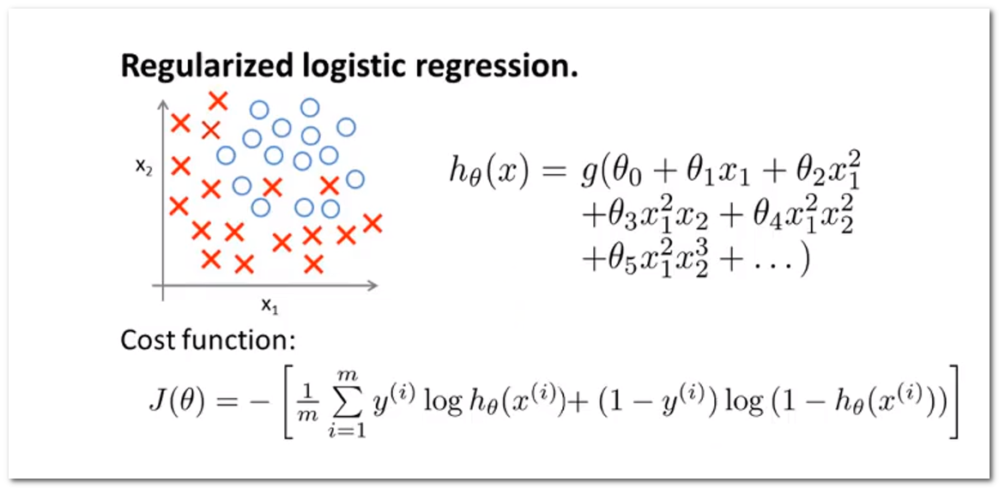

#机器学习笔记

@(机器学习)

[TOC]
###机器学习笔记（一）
####1. 一些希腊字母的写法
$\alpha$ :\alpha  $\beta$:   \beta   $ \gamma$: \gamma $\delta$: \delta  $\epsilon$:  \epsilon  $\eta$:  \eta $\theta$:  \theta $ \lambda$:  \lambda $\mu$:\mu
#### 2. 线性回归与梯度下降
#####2.1线性回归模型
Hypothesis:&nbsp;$h_\theta(x)=\theta^Tx=\theta_0x_0+\theta_1x_1+\theta_2x_2+\cdots+\theta_nx_n$
Parameters: &nbsp;$\theta_0,\theta_1,\ldots,\theta_n$
Cost function:$$J(\theta_0,\theta_1,\ldots,\theta_n)=\frac{1}{2m}\sum_{i=1}^m(h_\theta(x^{(i)})-y^{(i)})^2$$
#####2.2  梯度下降算法
$repeat &emsp;  until &emsp; convergence :\{$
$\theta_j :=\theta_j -\alpha \frac{\partial}{\partial \theta_j} J(\theta_0,\theta_1)$
$\}$
直接将线性回归模型公式代入梯度下降公式可得出公式：
$repeat &emsp;  until &emsp; convergence :\{$
$$\theta_0 :=\theta_0-\alpha \sum_{i=1}^m(h_\theta(x^{(i)})-y^{(i)})$$
$$ \theta_1 :=\theta_1-\alpha \sum_{i=1}^m(h_\theta(x^{(i)})-y^{(i)})x_1^{(i)}$$
$\}$

$$\begin{align*} \text{repeat until convergence: } \lbrace & \newline \theta_0 := & \theta_0 - \alpha \frac{1}{m} \sum\limits_{i=1}^{m}(h_\theta(x_{i}) - y_{i}) \newline \theta_1 := & \theta_1 - \alpha \frac{1}{m} \sum\limits_{i=1}^{m}\left((h_\theta(x_{i}) - y_{i}) x_{i}\right) \newline \rbrace& \end{align*}$$
####3.正规方程法代价函数:
$\theta=(X^TX)^{-1}X^Ty$
####4.Octave基本代码

#####4.1 分号抑制打印 
```
>>a = 3;  
>>
```
#####4.2 屏幕输出
```
>>disp(a)
 3.1400
>>a=3.14
a =  3.1400
>>disp(sprintf('2 decimals:%0.2f',a))
2 decimals:3.14
>>a=pi
a =  3.1416
>>format long
>>a
a =  3.14159265358979
>>format short
>>a
a =  3.1416
```
#####4.3 矩阵与向量
######4.3.1 *矩阵的创建*
```
>>>A = [1 2; 3 4; 5 6]
A =
   1   2
   3   4
   5   6
>>>v = [1 2 3]
v =
   1   2   3
>>>v = [1; 2; 3]
v =
   1
   2
   3
>>>v = 1:6
v =
   1   2   3   4   5   6
```
######4.3.2  *全为1的矩阵*
```
>>>ones(2,3)
ans =
   1   1   1
   1   1   1
>>>w = ones(1,3)
w =
   1   1   1
```
######4.3.3  *随机矩阵*
```
>>>w = rand(3,3)
w =
   0.91025   0.82671   0.14067
   0.90400   0.34350   0.51289
   0.25501   0.24975   0.80750

>>>w = randn(1,3)
w =
  -0.052546  -1.786869   0.754202
```
######4.3.4  *单位矩阵*
```
>>eye(3)
ans =
Diagonal Matrix
     1   0   0   
     0   1   0   
     0   0   1  
>>flipud(eye(3)) %反方向的矩阵
ans =
Permutation Matrix
   0   0   1
   0   1   0
   1   0   0 
```
######4.3.5 *幻方矩阵*
```
>> A = magic(5)
A =
   17   24    1    8   15
   23    5    7   14   16
    4    6   13   20   22
   10   12   19   21    3
   11   18   25    2    9
>> sum(A,1) %每列元素求和
ans =

   65   65   65   65   65

>> sum(A,2) %每行元素求和
ans =

   65
   65
   65
   65
   65
>> sum(sum(A.*eye(5))) %对角线元素之和
ans =  65
```
#####4.4 移动数据
######4.4.1 *显示当前路径和修改路径*
```
>>pwd
ans = C:\Users\pamela
>>cd 'C:\Users\Public\Desktop'
>>pwd
ans = C:\Users\Public\Desktop
```
######4.4.2 *加载数据*
```
load featuresX.dat
load priceY.dat
```
######4.4.3 *显示所有变量*
```
>> who
Variables in the current scope:

a    ans  b    c
```
######4.4.4  *保存数据*
```
>>save hello.dat v
保存数据为指定格式
>>save hello.txt v -ascii
```
######4.4.5 *根据矩阵索引获取指定元素*
```
>> A = [1 2; 3 4; 5 6]
A =
   1   2
   3   4
   5   6
>> A(3,2)
ans =  6
>> A(2,:) % 取第二行数据
ans =
   3   4
>> A(:,2) % 取第二列数据
ans =
   2
   4
   6
>> A([1 3], :)  %取第一行和第三行数据
ans =
   1   2
   5   6
>>A(:)  %把A中所有元素放入一个单独的列向量
ans =
   1
   3
   5
   2
   4
   6
```
######4.4.6 *矩阵的合并*
```
>> A = [1 2; 3 4; 5 6];
>> B = [11 12; 13 14; 15 16];
>> C = [A B]
C =
    1    2   11   12
    3    4   13   14
    5    6   15   16
>> C = [A; B]
C =
    1    2
    3    4
    5    6
   11   12
   13   14
   15   16
```
######4.4.7 *矩阵的计算*
```
>> A = [1 2; 3 4; 5 6];
>> B = [11 12; 13 14; 15 16];
>> C = [1 1; 2 2];
>> A*C   %矩阵相乘
ans =
    5    5
   11   11
   17   17
>> A .* B  % 矩阵之间对应元素之间相乘
ans =
   11   24
   39   56
   75   96
>> A .^ 2  %A中各元素求平方
ans =
    1    4
    9   16
   25   36
>> A'  %矩阵转置
ans =

   1   3   5
   2   4   6
```
######4.4.8 *对向量中的每个元素加1的三种方式*
```
>> v = [1;2;3]
v =
   1
   2
   3
>> v + ones(length(v), 1) %构造3行1列的列向量
ans =
   2
   3
   4
>> v + ones(3,1)
ans =
   2
   3
   4
>> v + 1  %直接加1
ans =
   2
   3
   4
```
######4.4.9 *矩阵求逆*
```
>> A = magic(3)
A =
   8   1   6
   3   5   7
   4   9   2
>> pinv(A)
ans =
   0.147222  -0.144444   0.063889
  -0.061111   0.022222   0.105556
  -0.019444   0.188889  -0.102778
>> temp = pinv(A)
temp =
   0.147222  -0.144444   0.063889
  -0.061111   0.022222   0.105556
  -0.019444   0.188889  -0.102778
>> temp * A
ans =
   1.00000   0.00000  -0.00000
  -0.00000   1.00000   0.00000
   0.00000   0.00000   1.00000
```
#####4.5 绘制函数图像
######4.5.1 *绘制正弦函数*
```
>>t=[0:0.01:0.98];
>>y1=sin(2*pi*4*t);
>>plot(t,y1);
>>print -dpng 'myplot.png'
```


######4.5.2 *绘制余弦函数*
```
>>t=[0:0.01:0.98];
>>y2=cos(2*pi*4*t);
>>plot(t,y2);
>>xlabel('time')
>>ylabel('value')
>>#title('')
>>title('cos')
>>print -dpng 'cos.png'
```


###### 4.5.3 *正弦、余弦展示在同一坐标轴*
```
>> plot(t, y1);
>> hold on;
>> plot(t, y2, 'r');
>> xlabel('time')
>> ylabel('value')
>> legend('sin', 'cos')
>> title('my plot')
>> print -dpng 'myplot.png'
```


###### 4.5.4  *将两个图像放入同一表格*
*将图像分为2个格子，调整第二个格子的坐标轴刻度，x轴调整到0.5到1的范围，y轴调整到-1到1的范围*
```
>> subplot(1,2,1);
>> plot(t, y1);
>> subplot(1,2,2);
>> plot(t, y2);
>> axis([0.5 1 -1 1])
```


######4.5.5 *把矩阵绘制成图像*
```
>> A = magic(5);
>> imagesc(A) %绘制颜色图像
>> imagesc(A), colorbar, colormap gray;
% colorbar 绘制颜色条
% colormap gray 绘制灰度分布图
```

#####4.6定义函数和调用函数
######4.6.1 *定义函数*
```
function J = costFunctionJ(X,y,theta)
m = size(X,1);
predictions = X*theta;
sqrErrors = (predictions-y).^2;
J = 1/(2*m) * sum(sqrErrors);
```
解释：设定 m 为训练样本的数量，也就是 X 的行数。 计算预测值 predictions 预测值等于 X 乘以 theta 。下面就是计算平方误差公式，就是预测值减去 y 值， 然后取出来每一项进行平方， 最后就可以 计算代价函数 J 。
######4.6.2 *调用函数*
```
>> x = [1 1; 1 2; 1 3];
>> y = [1; 2; 3];
>> theta = [0;1];
>> j = costFunctionJ(x,y,theta)
j=0
```
##### 4.7 基本命令
- 简化命令行：PS1('>> ');
- 关闭图表：close或close all
- 命令行清屏：clc
- ls : 列出目录文件和文件夹
- cd .. : 回到上级目录
#### 5.逻辑回归
#####5.1逻辑回归代价函数

$h_{\theta}(x)=g(\theta^Tx)$ 
$z=\theta^Tx$
$g(z)=\frac{1}{1+e^{-z}}$
$$J(\theta)=\frac{1}{m}\sum_{i=1}^mCost(h_{\theta}(x^{(i)}),y^{(i)})$$
$$Cost(h_{\theta}(x),y)=\begin{cases}
-log(h_{\theta)}(x)) & if& y=1\\
-log(1-h_{\theta)}(x))  &if &y=0
\end{cases} $$
$Note:y=0 &emsp; or  &emsp; 1  &emsp; always$
#####5.2 简化代价函数
$$J(\theta)=\frac{1}{m}\sum_{i=1}^mCost(h_{\theta}(x^{(i)}),y^{(i)}) 
= -\frac{1}{m}[\sum_{i=1}^m y^{(i)}logh_{\theta}(x^{(i)})+(1-y^{(i)})log(1-h_{\theta}(x^{(i)}) ]$$
$Want &emsp; min_{\theta}J(\theta):$</br>
$Repeat \quad  \{$</br>
$\qquad\quad$    $\theta_j :=\theta_j- \alpha\frac{\partial }{\partial \theta_j} J(\theta)$ </br>
$ \qquad \}$ 
$\frac{\partial }{\partial \theta_j} J(\theta)$的求导过程如下：

最终的迭代公式为：
$$\theta_j :=\theta_j-\alpha \sum_{i=1}^m(h_\theta(x^{(i)})-y^{(i)})x_j^{(i)}$$
#####5.3高级优化算法
```
>>cd 'C:\Users\pamela\Desktop'  %进入存放函数文件的目录
>>options=optimset('GradObj','on','MaxIter',100);
%GradObj – 用户定义的目标函数的梯度
%on - 使用自定义的梯度下降公式
%MaxIter – 最大允许迭代次数。
%100 - 迭代次数
>>initialTheta=zeros(2,1)
initialTheta  =
   0
   0
>>[optTheta,functionVal,exitFlag]=fminunc(@costFunction,initialTheta,options);
%@costFunction -调用代价函数
%initialTheta -该列向量为用户自定义梯度下降法的输出参数。使用前要预先初始化
%options -指定是否使用用户自定义的梯度下降公式（GradObj）以及迭代次数（MaxIter）。
>optTheta =   
   5.0000
   5.0000
 %自定义参数的最优值
functionVal =   1.5777e-030 
%代价函数的输出结果
exitFlag  =  1  
% exitflag 描述退出条件
exitflag>0 表示目标函数收敛于解x处。
exitflag=0 表示已经达到函数评价或迭代的最大次数。
exitflag<0 表示目标函数不收敛。
```
###机器学习笔记（二）
#### 1 .正则化
#####1.1过拟合
######1.1.1 定义
如果我们有非常多的特征，那么所学的Hypothesis有可能对训练集拟合的非常好()，但是对于新数据预测的很差。


######1.1.2解决途径
a) 减少特征的数量：
- 人工的选择保留哪些特征；
- 模型选择算法

b) 正则化
- 保留所有的特征，但是降低参数的量/值；
- 正则化的好处是当特征很多时，每一个特征都  会对预测y贡献一份合适的力量；
#####1.2代价函数
假设我们的模型是：
$h_\theta(x)=\theta_0+\theta_1 x_1+\theta_2 x_2+\theta_3 x_3 +\theta_4 x_4$
 &emsp; 从上图可以看出正式那些高次项导致了过拟合的产生。所以如果让这些高次项的系数接近于0的话，就能很好的拟合了。所以我们要在一定程度上减小这些参数$\theta$的值，这是正则化的基本方法所以修改代价函数，在$\theta_3$和$\theta_4$上加一些惩罚。修改后的代价函数如下：
$$min_\theta \frac{1}{2m}[\sum_{i=1}^m(h_\theta(x^{(i)})-y^{(i)})^2+1000\theta_3^2+1000\theta_4^2]$$
通过这样的代价函数选择出的$\theta_3$和$\theta_4$对预测结果的影响就比之前小许多。但是如果有许多的特征，但是我们不清楚哪些特征需要惩罚。所以需要我们找到一个比价全面的代价函数：
$$J(\theta)=\frac{1}{2m}[\sum_{i=1}^m(h_\theta(x^{(i)})-y^{(i)})^2+\lambda \sum_{j=1}^n\theta_j^2]$$
其中$\lambda$又称为正则化参数，$\lambda$的取值要选择合理的值。注：根据惯例，不对$\theta_0$进行惩罚。
#####1.3正则化线性回归
正则化线性回归的代价函数为：
$$J(\theta)=\frac{1}{2m}[\sum_{i=1}^m(h_\theta(x^{(i)})-y^{(i)})^2+\lambda \sum_{j=1}^n\theta_j^2]$$
######1.3.1梯度下降
用梯度下降法令代价函数最小化：
$Repeat &emsp; until  &emsp;convergence \{$
 $$\theta_0 :=\theta_0- \alpha \frac{1}{m}\sum_{i=1}^m[h_\theta(x^{(i)})-y^{(i)})]x_0^{(i)}$$
$$\theta_j :=\theta_j- \alpha \frac{1}{m}\sum_{i=1}^m[h_\theta(x^{(i)})-y^{(i)})]x_j^{(i)}+\frac{\lambda}{m}\theta_j $$
&emsp; $\}$
$Repeat$
对上面的算法中 $j=1,2,\cdots, n$ 时的更新式子进行调整可得：
$$\theta_j :=\theta_j(1-\frac{\lambda}{m})- \alpha \frac{1}{m}\sum_{i=1}^m[h_\theta(x^{(i)})-y^{(i)})]x_j^{(i)} $$
可以看出，正则化线性回归的梯度下降算法的变化在于：每次都在原有算法更新规则的基础上令$\theta$值减少一个额外的值
######1.3.2正规化方程

#####1.4正则化的逻辑回归模型

给代价函数增加一个正则化表达式：
$$J(\theta)= -\frac{1}{m}[\sum_{i=1}^m y^{(i)}logh_{\theta}(x^{(i)})+(1-y^{(i)})log(1-h_{\theta}(x^{(i)}) ] +\frac{\lambda}{2m}\sum_{j=1}^n\theta_j^2$$
想要最小化该代价函数，通过求导，得出梯度下降算法为：
$Repeat &emsp; until  &emsp;convergence \{$
 $$\theta_0 :=\theta_0- \alpha \frac{1}{m}\sum_{i=1}^m(h_\theta(x^{(i)})-y^{(i)}))x_0^{(i)}$$
$$\theta_j :=\theta_j- \alpha \frac{1}{m}\sum_{i=1}^m(h_\theta(x^{(i)})-y^{(i)}))x_j^{(i)}+\frac{\lambda}{m}\theta_j $$
&emsp; $\}$
$Repeat$
注：虽然看上去同线性回归一样，但是 $h_\theta(x)=g(\theta^TX)$，所以和线性回归不一样。

